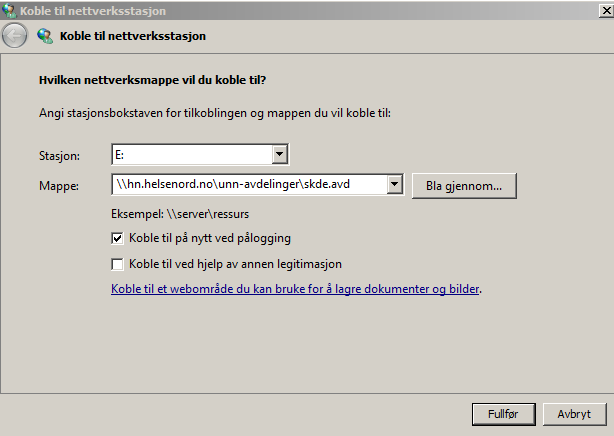

# Diverse annet

## Koble til nettverksstasjonen `\\hn.helsenord.no\unn-avdelinger\skde.avd`

Av en eller annen grunn må man i noen tilfeller koble til nettverksstasjonen på nytt når man logger seg på maskinen. Da gjør man følgende:
- Velg `Verktøy/Koble til nettverksstajon...` i utforskeren
- Legg inn følgende informasjon

Ved å velge en annen stasjon enn `e:` kan man unngå at man må koble seg opp på nytt hver dag.
