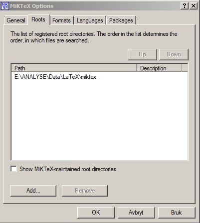

# Hvordan installere LaTeX på SKDE-maskiner

Hvis det oppstår problemer med denne fremgangsmåten, send gjerne en beskjed til <A HREF="mailto:&#097;&#114;&#110;&#102;&#105;&#110;&#110;&#046;&#115;&#116;&#101;&#105;&#110;&#100;&#097;&#108;&#064;&#115;&#107;&#100;&#101;&#046;&#110;&#111;">arnfinn</A>.

## Bruk heller Overleaf

*Det anbefales sterkt å bruke [overleaf.com](https://www.overleaf.com) i steden for å installere sin egen LaTeX på maskinen*. 

## Installere MikTeX

Dette er selve LaTeX. 

1. Last ned fra [denne siden](http://miktex.org/download)
2. Installér programmet på ditt hjemmeområdet på `c:`
3. Gå inn på `Start/Alle programmer/MikTeX 2.9/Maintenance/Settings`
    1. Sjekk at General-fanen ser omtrent slik ut:  
  
    2. Gå inn på Roots-fanen og legg inn følgende mappe (så slipper man å laste ned pakker hele tiden; det vil nå ta litt tid å samle informasjon):   
  
4. Gå inn på `START/Alle programmer/MikTeX 2.9/Maintenance/Package Manager`
    1. Gå så inn på `Repository/Change Package Repository` og trykk på `Connection Settings...`  
  
    2. Her legger man inn en proxy med adresse `www-proxy.helsenord.no` og port nummer `8080`:  

    3. Trykk `OK` og `Neste`, og skriv inn ditt brukernavn og passord i SKDE
    4. Velg en `remote package repository` nær deg, av typen 'http'

## Installere Texmaker 

Dette er programmet vi skal skrive LaTeX i.

1. Last ned fra [denne siden](http://www.xm1math.net/texmaker/download.html)
2. Installér programmet på ditt hjemmeområdet på c:  
3. Slik ser min TeXmaker ut (har satt den til å lage pdf med PDFLaTeX)  
  

Man kan velge et annet skriveprogram hvis man vil, f.eks [TeXnicCenter](http://www.texniccenter.org).

## Bruke LaTeX

Introduksjon [her](latex_intro.html). Ellers er [google](http://www.google.no/search?q=introduction+to+latex) din venn.  

# Spor endringer i LaTeX ved bruk av *latexdiff*

*latexdiff* lager en tex-fil ut fra forskjellene mellom to tex-filer, og fargelegger/stryker over det som er gjort av endringer mellom to versjoner.  Denne tex-filen kan vi så kompilere og lage en pdf.
Alt dette må gjøres lokalt, noe som betyr at LaTeX må være installert på maskinen (MikTeX, hvis du sitter på en Windows-maskin). I tillegg må man ha *python* installert (mer om det senere).

## Slå sammen flere flettede tex-filer til én tex-fil

Vi jobber som regel med flere tex-filer ved bruk av `\input{}`. *latexdiff* fungerer bare på en fil av gangen. Vi må derfor samle sammen alle filene til én. Følgende *python*-script samler sammen flere tex-filer til én fil (kopiert fra [Andrew Walker](http://dropbearcode.blogspot.no/2011/09/multiple-file-latex-diff.html)):
```
#!/usr/bin/env python
import sys
import os
import re

inputPattern = re.compile('\\input{(.*)}')

def flattenLatex( rootFilename ):
    dirpath, filename = os.path.split(rootFilename)
    with open(rootFilename,'r') as fh:
        for line in fh:
            match = inputPattern.search( line )
            if match:
                newFile = match.group(1)
                if not newFile.endswith('tex'):
                    newFile += '.tex'
                flattenLatex( os.path.join(dirpath,newFile) )
            else:
                sys.stdout.write(line)

if __name__ == "__main__":
    flattenLatex( sys.argv[1] )
```

1. Kopier innholdet til en fil, kall filen f.eks *flatten-latex.py*, og legg den i mappen der du skal sammenligne to dokumenter
2. Åpne ´bash´ i denne mappen (´git-bash´ hvis du sitter på en Windows-maskin).
3. Gjør skriptet kjørbart: ´chmod u+x flatten-latex.py´
4. Sørg for at du har to mapper med to ulike versjoner av et LaTeX-prosjekt i samme mappe (dette kan gjøres ved å klone samme overleaf-dokument to ganger og gå tilbake i historien på det ene).
5. Lag flate tex-versjoner av de to LaTeX-prosjektene:
  ```
  ./flatten-latex.py mappe1/rapport.tex > gammel.tex
  ./flatten-latex.py mappe2/rapport.tex > ny.tex
  ```
  Man har nå to tex-filer man kan kjøre *latexdiff* på
	
## Kjøre *latexdiff* på to tex-filer

- Vi kan nå lage en ny tex-fil, som vi legger i mappen der nyeste versjon av LaTeX-prosjektet ligger (i dette tilfelle ´mappe2´)
```
latexdiff gammel.tex ny.tex > mappe2/diff.tex
```
  Det legges i den mappen, slik at vi kan kompilere filen etterpå og få med figurer etc.
- Gå inn i mappen og kompiler dokumentet (i vårt tilfelle bruker vi som regel *lualatex*
```
cd mappe2
lualatex diff
biber diff
lualatex diff
lualatex diff
```
  Dette går som regel ikke smertefritt... Jeg fikk det ikke til på første forsøk i Windows. Hvis du er heldig har du nå et dokument som heter *diff.pdf* som viser endringene mellom to versjoner.


  


