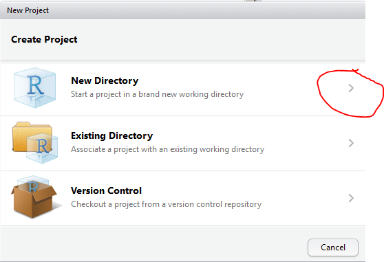

# Rshiny

Hvis det oppstår problemer med noen av disse fremgangsmåtene, send gjerne en beskjed til <A HREF="mailto:&#097;&#114;&#110;&#102;&#105;&#110;&#110;&#046;&#115;&#116;&#101;&#105;&#110;&#100;&#097;&#108;&#064;&#115;&#107;&#100;&#101;&#046;&#110;&#111;">arnfinn</A>.


## Rstudio og shinyapps gjennom proxy

- [Opprett en ny](new_rshiny.md) eller åpne en gammel "Shiny web application" i Rstudio.
- Opprett en bruker på [shinyapps](http://www.shinyapps.io)
- Installer shinyapps fra github

```r
install_github("rstudio/shinyapps")
```

- Kjør gjennom proxy
```r
options(RCurlOptions = list(proxy = "http://www-proxy.helsenord.no:8080"))
options(shinyapps.http = "rcurl")
```
- Kopier din token fra [shinyapps](http://www.shinyapps.io/admin/#/tokens) og kopier over i "Manage Accounts"


- Last opp din shinyapp til shinyapps.io. Jeg fikk ikke til å gjøre dette ved hjelp av knappen over, men måtte gjøre dette i konsollen.

```r
shinyapps::deployApp('../my_new_shinyapp')
```


### Alternativ fremgangsmåte

- Denne må dokumenteres...

```r
library(rsconnect)
deployApp()
```


## Hvordan opprette en ny Rshiny applikasjon





