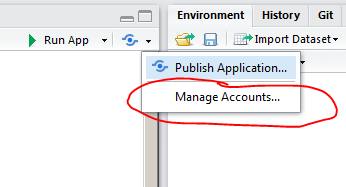
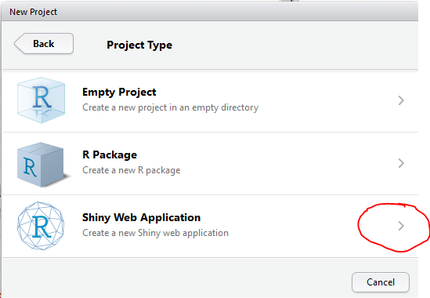
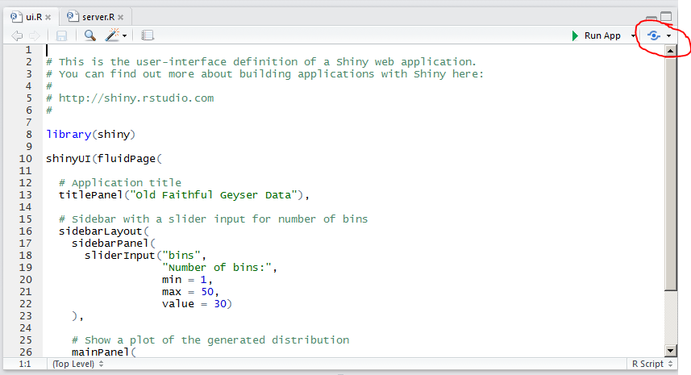

# Rshiny

Hvis det oppstår problemer med noen av disse fremgangsmåtene, send gjerne en beskjed til <A HREF="mailto:&#097;&#114;&#110;&#102;&#105;&#110;&#110;&#046;&#115;&#116;&#101;&#105;&#110;&#100;&#097;&#108;&#064;&#115;&#107;&#100;&#101;&#046;&#110;&#111;">arnfinn</A>.


## Rstudio og shinyapps gjennom proxy


### Første gang

- Installér shiny-pakken
```r
install.packages("shiny")
```
- Opprett en bruker på [shinyapps.io](http://www.shinyapps.io)
- [Opprett en ny](new_rshiny.md) eller åpne en gammel "Shiny web application" i Rstudio.
- Kopier din token fra [shinyapps](http://www.shinyapps.io/admin/#/tokens) og kopier over i "Manage Accounts"




### Laste opp en shinyapp til http://www.shinyapps.io


- Dette må gjøres gjennom proxy, så følgende kommandoer må kjøres først
```r
options(RCurlOptions = list(proxy = "http://www-proxy.helsenord.no:8080"))
options(shinyapps.http = "rcurl")
library(rsconnect)
```
- Selve shinyappen lastes opp med følgende kommando
```r
deployApp()
```

## Hvordan opprette en ny Rshiny applikasjon







