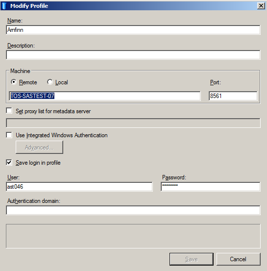
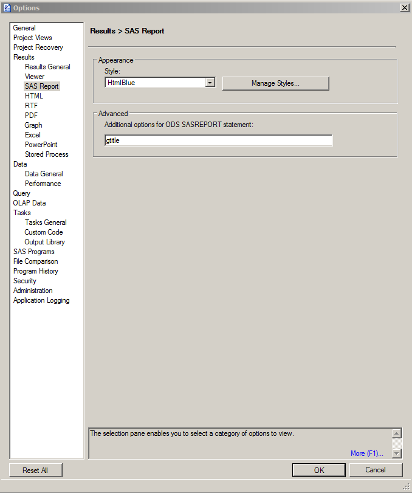

# Huskeliste for arbeid med SAS på SKDE

## Koble til server i SAS Enterprise Guide

- Gå på `Tools/Connections...`
- Legg til en profil. Den skal se noe slik ut, med maskinnavn `TOS-SASTEST-07`



## Legge SAS-server til utforsker

- Gå på `Verktøy/Koble til nettverkstasjon`
- Stasjon: `Z` (ikke kritisk, men de fleste andre har valgt Z)
- Mappe: `\\tos-sastest-07\SKDE`

## Lagring av sensitive datasett

- Sensitive datasett *skal* lagres på npr_utva! Disse skal slettes hvert år, når vi får nye data i hus
```sas
data mittutvalg;
set npr_utva.ahs_utvalg1;

...

run;
```

## Inkludere macroer etc.

### Laste inn vår egen autocomplete-fil

- Dette gjøres slik at man kan enkelt få inn rateprogram etc. i sas-prosjektet

1. Gå inn på *Program/Editor Macros/Macros*
2. *Import...*
3. Gå inn på `E:\ANALYSE\Data\SAS\Makroer\Abb_macro` og velg *Auto_Makro.kmf*
4. *Close*
5. Med ujevne mellomrom oppdateres *Abb_macro*, og man må da kjøre stegene 1 til 4 på nytt. Vi får prøve å gi beskjed om dette internt...

- Hvis man nå begynner å skrive `auto` vil *AUTO_MACRO* kommer opp i en liste.
- Hvis man velger denne, vil følgende tekst legge seg inn i sas-programmet ditt
```
%let filbane=\\hn.helsenord.no\UNN-Avdelinger\SKDE.avd\Analyse\Data\SAS\;
options sasautos=("&filbane.Makroer" SASAUTOS);
```

## Lage en makro

- En makro kan se omtrent slik ut:
```
%macro macronavn(datasett=);

data &datasett;
run &datasett;
...
*gjør noe her med datasettet;
...

%mend macronavn;
```
- Hvis man lagrer en fil med navn `macronavn.sas` i `ANALYSE/Data/SAS/Makroer/` kan andre bruke denne hvis de har kjørt følgende kode i SAS-prosjektet:
```
%let filbane=\\hn.helsenord.no\UNN-Avdelinger\SKDE.avd\Analyse\Data\SAS\;
options sasautos=("&filbane.Makroer" SASAUTOS);
```

## gtitle

For at tittel skal bli lagt på figurene som produseres i SAS, må følgende gjøres i SAS Enterprise Guide:

- Gå inn på `Tools/Options...` og skriv inn følgende:


## Redusere størrelsen på datasett

Alle verdier lagres som standard med 8 bytes. Dette er i de fleste av våre tilfeller ikke nødvendig. SAS kan redusere plassen hvert tall tar på disk ned til 3 bytes. I tillegg har SAS verktøy for å komprimere datasett.

- Jeg har lagt til en macro som heter squeeze, som finner ut hvor liten plass hver variabel kan reduseres til, og reduserer antall bytes tilsvarende (denne har jeg ikke skrevet selv). Den kjøres slik:
```
%squeeze(inndata, utdata);
```
- Hvis man vil komprimere datasett, gjør man følgende (dette vil føre til at SAS bruker lenger tid på å lese datasettet neste gang, siden datasettet må pakkes opp igjen):
```
data komprimertDatasett (compress=binary);
set ukomprimertDatasett;
run;
```
- Det er også mulig med `compress=yes` og `compress=char`

Jeg har kjørt ulike komprimeringer på et årssett (2011) og fått følgende størrelser:


- Type     | Kommando   | Størrelse (GB) |
- Original |            | 8.99 |
- Squeeze  | %squeeze   | 5.53 |
- Compress | yes        | 3.34 |
- Compress | char       | 3.34 |
- Compress | binary     | 2.68 |
- Squeeze-Compress | %squeeze/binary | 2.37 |


